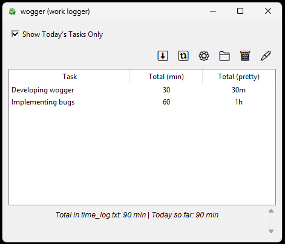

# Wogger: The Work Logger You Never Knew You Needed

Have you ever faced the once-a-year, one-month productivity review period and realized you forgot to track half the things you did?

Introducing Wogger: the retro-looking, possibly-buggy-but-totally-lovable time-tracking application you didn’t know you craved.

## What Does Wogger Do, Exactly?

- **Pop-up Time Tracking**
At default intervals of 0, 15, 30, and 45 minutes past the hour (optional custom cron expressions, if you dare!), Wogger politely—sometimes—pops up to ask what you’re working on.

- **Log-Viewing Pleasure**
View your logs from today, or if you’re a daredevil, see all your logs. We’ll even try to pretty-print them in weeks, days, and minutes (depending on Wogger’s mood).

- **Configurable Workdays**
Maybe your week starts on a Thursday. Maybe your workday ends at 4 AM. We don’t judge—just don’t be surprised if the math gets creative.

- **Manual Log Entries**
Feeling rebellious? Skip the pop-ups and type your logs manually. That’s right, no more messing around with text files—unless you really, really want to.

- **Time Log Reset**
When you get tired of the “ancient wisdom” in time_log.txt, Wogger offers a magical reset that renames the old log and starts you fresh. Out with the old, in with the maybe-still-buggy new!

- **Built with Python & Tkinter**
Expect that charming throwback feel. Buttons that may or may not respond to clicks. It’s all part of the retro user experience, right?


___

## Don’t Believe Us?



## I need this in my life!

**Well, you're in luck!**

You can download the latest release from the relases page [here](https://github) and start ***wogging*** right away!

## I want to run this from source

### Prerequisites

- Python 3.7 or higher
- Familiarity with the command line (or at least an adventurous spirit)
- Basic knowledge of creating virtual environments
- Administrative privileges on the system

### 1. Create a Virtual Environment

```bash
python -m venv venv
```

**Activate the venv:**

- Windows (CMD):
```bash
venv\Scripts\activate
```
- Windows (PowerShell):
```bash
.\venv\Scripts\activate
```
- macOS/Linux:
```bash
source venv/bin/activate
```

### 2. Install Dependencies

```bash
pip install -r requirements.txt
```

### 3. Run Wogger
    
```bash
python main.py
```
**or**
```bash
python -m main
```

4. (Optional) Deactivate the Virtual Environment

```bash
deactivate
```

## I want to build my own executable

You will find the instructions to build your own executable in the `exe_bundling_process.md` file [here](exe_bundling_process.md).

## Contributing

Do you see a bug lurking, or have a brilliant idea to make Wogger even more “retro-chic”? Feel free to fork this repository, write some code, and open a pull request! We’d love to see how you can help make it even more unpredictably delightful.

**Happy Wogging!** And remember, if the buttons don’t work the first time, just keep clicking. Wogger loves attention.

___

### License
Wogger is released under the "Try-At-Your-Own-Risk" license, which is loosely based on the MIT License but sprinkled with extra disclaimers:

1. No Warranty
Wogger may or may not help you become more productive. It might just amuse your cat who loves randomly tapping your keyboard. Use responsibly (or not).

2. Liability
If Wogger somehow causes you to accidentally log 36 hours in a 24-hour day, forget to feed your dog, or triggers an unexpected midlife crisis, we accept absolutely no responsibility.

3. Permission
You’re free to fork this glorious masterpiece, modify it, redistribute it, and even use it for your fancy corporate time-tracking—just make sure you keep this notice intact so people know who to blame.

4. Trademark
We don’t actually own the word “Wogger” in a legal sense—if it causes confusion with anything else that sounds vaguely the same, blame your ears, not us.

Basically, Wogger is provided “as is,” with all its quirks and possible inefficiencies. We hope you’ll enjoy using (or breaking) it!


